## About Me

### Hey there, I am Nubshot. I am just someone who enjoys programming and math

## Languages & Stacks
 
| Language   | Role            | Stack                  |
|------------|-----------------|-------------------------|
| Python     | General-Purpose | Ecosystem-Driven        |
| JavaScript | Web Development | Express + React         |
| C#         | Cross-Platform  | Aspnet + Maui Blazor    |
| Dart       | Cross-Platform  | Relic + Flutter         |
| Go         | Performance     | Standard Library        |

## GitHub Stats

 

 
 
 
 
 
 
 
 
 
 
 

